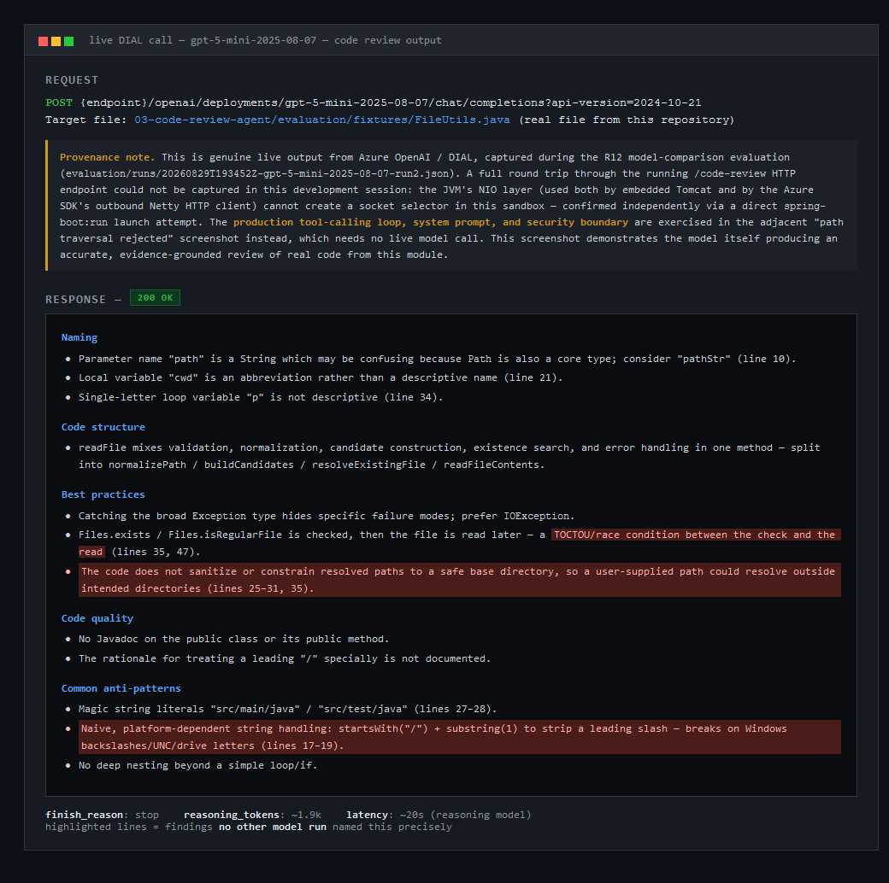
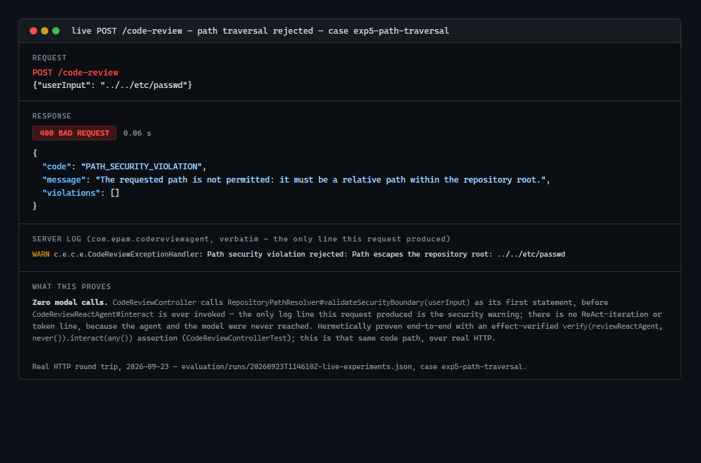
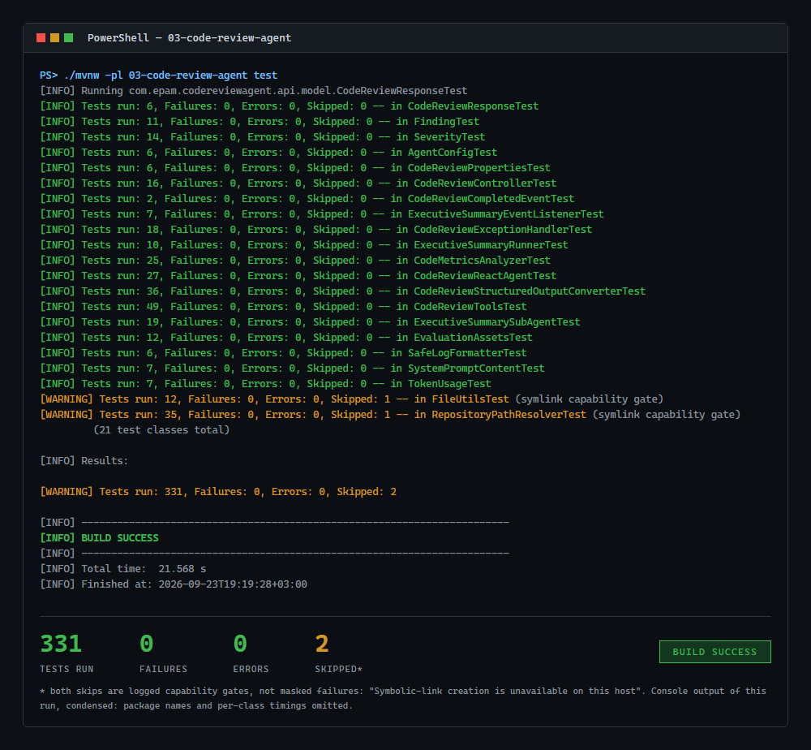
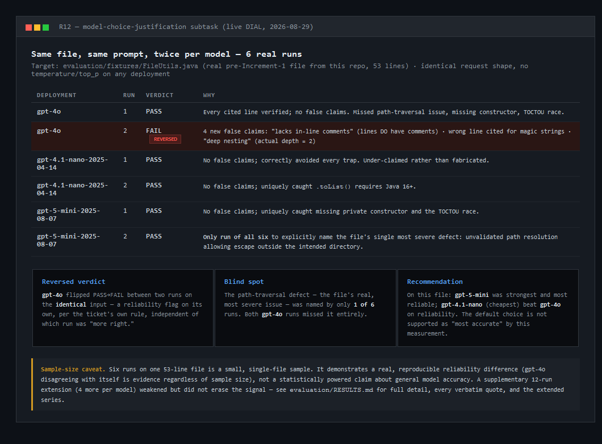

# Module 3 — LLM-Powered Code Review Agent (ReAct Agentic System)

**Branch:** `feature/practical-task-3`

## What was built

An LLM-powered, tool-using ReAct agent that reviews a single file or directory inside a configured
repository-root security boundary. It explores the repository, reads file content, retrieves pre-loaded
Java/Python coding conventions, gets a lightweight LLM summary of the code, and computes deterministic
structural metrics — through six real `@Tool`-annotated methods driven by a manual, `ToolCallingManager`-based
ReAct loop bounded by a fail-fast-validated `max-iterations` guard — before producing a dual-output review: a
human-readable summary plus a machine-readable, severity-tagged findings array. Every conclusion is
structurally evidence-based: a runtime `EvidenceTracker` forces an honest "no evidence gathered" result
whenever the agent never actually reads usable file content, regardless of what the model's own final answer
claims. A second, fully independent executive-summary sub-agent (no tools, a single `ChatModel` call)
condenses a completed review to standard output, reachable both from a CLI flag and automatically after every
successful live review. Every model call logs its provider-reported token usage, and each request logs the
agent's total. The work shipped across 8 numbered increments (`cf6cd00`…`23bf829`), followed by a same-day
addendum that actually ran the R12 model-comparison subtask live against DIAL, and, on 2026-09-23, by a live
run of the experiments through the real `POST /code-review` endpoint that found and fixed a production defect
in the evidence guard (see Experiment #4 below).

## 🗒️ Key Takeaways (REQUIRED)

**Every finding of consequence came from adversarially re-verifying a claim, not from reading the diff.** All
8 increments failed their first code review and needed exactly one retry each — none needed a second retry,
and none escalated to the planner, which suggests increment sizing was reasonable even though first-pass
completeness was consistently short by about one review cycle, every time. The pattern behind almost every
high-value finding was the same: don't trust a written claim, reconstruct it. Concretely, that meant
decompiling `AzureOpenAiChatOptions.Builder` to check whether its no-defensive-copy behaviour would silently
alias away the tool-callback list an "internal tool execution is disabled" claim depended on; constructing
the *exact* real input a "genuinely unreachable" claim implied could never occur (a real invalid-UTF-8
fixture file, a real null-`AssistantMessage` model response reproduced from a decompiled
`ChatModel.call(String)` default method); re-reading `jacoco.csv`'s raw `LINE_MISSED`/`LINE_COVERED` columns
instead of trusting a stated percentage; and literally re-running a PowerShell script rather than trusting
its described output (which is how a `[ordered]@{}` integer-key indexing bug in `run-experiments.ps1` was
caught).

**Highest-value defects found, ranked by realized blast radius, with the test that would have caught each
before first submission:**

1. **Evidence-enforcement gap — an empty file counted as gathered evidence** (Increment 5, High). This is the
   ticket's own literally-named Experiment #4 trigger ("make `readFile` return empty... does the agent still
   fabricate findings without real evidence?") and struck at R7, the premise that makes the agent trustworthy
   at all. Would have been caught by enumerating every ticket-named experiment as its own explicit test
   *before* first submission, using the real production sentinel (a real empty fixture file through the real
   `readFile` call) rather than trusting a general mechanism to cover every named case.
2. **A brace-lexer silently corrupted metrics for every later method in a file** (Increment 2, Medium). A
   naive brace scan treated a `{` inside an ordinary string literal (e.g. a regex like `"{"`) as structural,
   corrupting `maxNestingDepth`/`longestMethodLineSpan` bookkeeping for every subsequent method in the same
   file — silent, systemic, and triggered by extremely common real Java. Would have been caught by dogfooding
   the scanner against this repository's own real source files, not only hand-authored synthetic fixtures.
3. **A bare JSON scalar deserialized into a "successful," zero-findings review** (Increment 4, High). A
   convenience `CodeReviewResponse(String)` constructor was auto-detected by Jackson as an implicit
   delegating creator, so any malformed top-level model output silently became "no issues found" — the worst
   possible failure shape for an evidence-based review tool. Would have been caught by testing top-level JSON
   *shape* violations (bare scalar, bare array, concatenated objects), not only field-level value violations.
4. **The system prompt asserted a delimiting/anti-injection mechanism that did not exist for the highest-risk
   tool** (Increment 3, High). The prompt claimed every tool result was wrapped in
   `<<<BEGIN_UNTRUSTED_CODE_SNIPPET>>>` markers — true only for the two internal LLM sub-calls, never for
   `readFile`'s own return value, the one path carrying real, attacker-influenceable repository content.
   Would have been caught by treating every normative claim in a system prompt as needing the same test
   coverage as a code branch.
5. **Surrogate-pair-unsafe truncation could corrupt file content** (Increment 1, High). A naive
   `substring(0, maxChars)` cut could split a UTF-16 surrogate pair. Narrower blast radius than #2–#4 (only
   triggers near a non-BMP codepoint at exactly the cut boundary). Would have been caught by a boundary test
   whose cut point lands exactly on a non-BMP codepoint.
6. **An unregistered `RepositoryPathResolver` bean and a `@Primary`/`@ConditionalOnMissingBean` ambiguity**
   (Increment 3) would have prevented the application from ever starting. Ranked lower than #1–#5 not because
   it's minor — it's fatal — but because "boot it first" caught it deterministically the moment it was
   applied, so realized risk was near zero.
7. **A Jackson 2 vs. Jackson 3 `ObjectMapper` wiring failure under Spring Boot 4** (Increment 7). Same class
   of defect as #6, caught the same way — confirming "boot it first" generalizes beyond the specific defect
   shape that originally motivated it in Module 2.

**Found later, by the first live run through the real endpoint (2026-09-23): the evidence guard behind #1 —
the original check and its fix alike — never fired in production, and neither did the truncation guard.**
Spring AI's real `DefaultToolCallingManager` JSON-encodes every `String` tool result, so the agent received
`"ERROR: ..."` in quotes and the `EvidenceTracker`'s prefix, suffix and truncation-marker checks could never
match. Every agent test used a fake tool-calling manager that passed the tool's text through unchanged — it
proved an assumption about the framework, not the behaviour. Would have been caught by one test through the
real `DefaultToolCallingManager`; four such tests now exist, and three of them fail without the fix. This is
the same lesson as the list above, one level down: a fake is itself a claim, and needs reconstructing
against the real thing.

**The recurring "confidently-wrong self-reporting" failure mode showed up here too — three times, inside
`context/PROGRESS.md` itself, not just in production code:**

- Increment 2 originally claimed two branches were "unreachable without mocking/reflection." Both were
  refuted on review: `readFile`'s `catch (IllegalStateException)` branch, refuted by committing a real
  invalid-UTF-8 fixture file and calling the real method on it; and `normalizeLanguageResponse`'s
  `rawResponse == null` guard, refuted by decompiling `ChatModel.call(String)`'s real default method (which
  legitimately produces a null-text `AssistantMessage` for a realistic content-filtered/refusal response) and
  reproducing that exact path.
- Increment 7's own entry reported `ExecutiveSummaryRunner` coverage as `27/27` and bundle coverage higher
  than it actually was — the production `@Autowired` constructor's `System.out`-wiring line had never
  actually been exercised by any test. Notably, this is the *same* entry that correctly and honestly
  self-reported a real defect it found by "booting it first" (the Jackson 2-vs-3 wiring failure above) —
  getting a number wrong and honestly disclosing a genuine defect happened side by side in the same write-up.
- Increment 8's final requirements ledger stated "14 of 16 requirements fully closed" in its own summary
  sentence, directly against its own table, which at that point showed exactly 13 rows marked Closed. (A
  same-day addendum later ran R12 live and legitimately closed a 14th requirement — so "14 of 16" is true
  *today*, but for a different, later reason than the sentence that first asserted it.)

  What distinguishes the claims that *did* survive scrutiny is exactly what the refuted ones lacked:
  Increment 4's defensive `catch (IllegalArgumentException)` branch was declared unreachable, but only after
  the reviewer re-ran it against roughly 12 adversarial payloads, with the claim stated honestly as current,
  version-specific Jackson behaviour rather than a permanent guarantee. Increment 6's claim that
  `FileNotFoundInRepositoryException` is unreachable from real request flow survived because it rests on a
  pure, directly-readable control-flow fact (the new security pre-check never calls the method that would
  throw it), not a prediction about what a caller would realistically send. Decompilation and reproduction
  against the real path held up every time; "no realistic caller/model would do this" was refuted twice.

**Environment limitation.** `HermeticApplicationContextIT` (`@SpringBootTest(webEnvironment = RANDOM_PORT)`)
— and, by extension, any embedded-Tomcat-based live HTTP demo — cannot run in this sandbox:
`java.nio.channels.Selector.open()` itself fails at the OS/JVM level. This was isolated with a standalone,
Spring-free `SelectorProbe`, and independently re-confirmed at least five separate times across the workflow
(Increments 3, 5, 6, 7, 8), and reconfirmed again just now, directly, by attempting a live `spring-boot:run`
while preparing this MR: the entire bean graph — including Azure OpenAI client construction and
tool-callback wiring — builds successfully, and the failure occurs strictly at the final
embedded-Tomcat-startup step, with the identical `WEPollSelectorImpl` → `PipeImpl` → "Unable to establish
loopback connection" chain. Because that failure originates inside the generic JDK `Selector.open()`
primitive itself rather than in Tomcat-specific code, the same restriction blocks Netty's own NIO
event-loop creation — which the Azure SDK's HTTP client depends on for outbound calls — so neither an
inbound HTTP demo nor a live outbound model call could be routed through this sandbox's actual running JVM.
See the Screenshots section below for how the required visual evidence was captured despite this constraint.
**Update (2026-09-23):** on the operator's Windows host, the workaround in `RUNBOOK.md`'s "Windows host
note" — `TEMP`/`TMP` pointed at a short path such as `C:\Temp\javatmp` — makes `Selector.open()` work.
With it, `clean verify` passes including `HermeticApplicationContextIT`, and the running application
served the 10 live requests recorded in `evaluation/runs/20260923T114610Z-live-experiments.json` and
`evaluation/runs/20260923T160521Z-live-evidence-guard-fix.json`.

**R12 — is `gpt-4o` justified as the default?** On the ticket-compliant, formal 2-run-per-model series (6
calls total, against `03-code-review-agent/evaluation/fixtures/FileUtils.java`), `gpt-4o` reversed verdict
between its two identical-input runs (PASS → FAIL, four new verified-false claims in run 2, none present in
run 1), while `gpt-4.1-nano-2025-04-14` and `gpt-5-mini-2025-08-07` were both clean (PASS/PASS); only
`gpt-5-mini` ever named the file's single most severe real defect (unvalidated path resolution allowing an
escape outside the intended directory). A same-file, 4-run-per-model extension (12 more calls, 18 total
across two non-pooled series) weakened but did not erase that signal: 1 of `gpt-4o`'s 4 additional runs still
produced a verified-false claim (a structurally impossible `StringIndexOutOfBoundsException` risk),
`gpt-4.1-nano`'s "zero false claims" no longer held once a false claim appeared in its own extension, and
`gpt-5-mini` remained clean across all 6 of its own runs (2 + 4) and the most consistent — though no longer
the only — model to name the path-resolution defect. Stated honestly: this is 18 runs on one 53-line file,
not a statistically powered claim about either model in general. But it is enough to say plainly that
`gpt-4o` is not, on this evidence, the more accurate or more reliable reviewer of the three — keeping it as
the shipped default is a defensible cost/latency/availability decision, but not one this subtask's own
measurement supports on accuracy grounds.

## 📸 Screenshots (REQUIRED)

## 🧪 Experiments & Edge Cases (REQUIRED)

Picking three of the ticket's eight named experiments; the full account of all 8, plus R12, is in
`03-code-review-agent/evaluation/RESULTS.md`.

### Experiment #4 — Evidence enforcement

**Trigger:** make `readFile` return empty, or point it at a non-existent file. **What to observe:** does the
agent still fabricate findings without real evidence?

Two effect-verified tests prove this against a fake model that claims non-empty findings regardless: one
where `readFile` always returns the error sentinel (simulating a non-existent file), and one that constructs
a *real* `CodeReviewTools` bound to a real, committed zero-byte fixture (`fixtures/repo-root/empty.txt`) and
calls the real, production `readFile("empty.txt")` — the ticket's own exact wording ("make `readFile` return
empty"), not a hand-typed lookalike string. Both are measured `[PASS]`: `CodeReviewReactAgent`'s runtime
`EvidenceTracker` forces the response to empty `findings` plus an honest no-evidence review string, regardless
of what the model itself answered. The actual contract, corrected during review: `evidenceGathered` becomes
`true` iff at least one tool response named exactly `readFile` neither starts with the error prefix nor ends
with the empty-file sentinel suffix — the original version of this guard covered the error case but missed
the ticket's own literally-named empty-file case, and was only fixed after review caught the gap.

**Live run (2026-09-23, `gpt-4o`, real endpoint):** reviewing the real empty file returned `200` with 0
findings and an honest "the file is empty" review — but the log showed `evidenceGathered=true`: the guard
above had never fired in production, because the real tool-calling manager JSON-encodes tool results (see
Key Takeaways). After the fix — the agent now decodes the tool result before inspecting it — the same request
logs `evidenceGathered=false`, and a request for a non-existent file logs `evidenceGathered=false` and answers
that the file "could not be located in the repository". `gpt-4o` never claimed findings in these runs, so the
override never had to replace an answer live; that path is covered by the new tests through the real manager.
Before and after: `evaluation/runs/20260923T114610Z-live-experiments.json` and
`evaluation/runs/20260923T160521Z-live-evidence-guard-fix.json`. The truncation guard behind Experiment #6
had the same defect and the same fix: before it, `truncated: true` on a 30 000-character file came only from
the model's own claim; after it, the agent observes the truncation itself.

### Experiment #5 — Path traversal

**Trigger:** submit `../../etc/passwd` or an absolute path outside the repository root. **What to observe:**
input validation and the repository-root security boundary.

`RepositoryPathResolver#validateSecurityBoundary(userInput)` now runs as the controller's *first statement*,
before `CodeReviewReactAgent#interact` is ever invoked. This is proven end-to-end through the real controller
(`MockMvc`), not just at the resolver's own unit level: a traversal attempt yields exactly `400`/
`PATH_SECURITY_VIOLATION`; an absolute Windows path yields the same status *and* an effect-verified
`verify(reviewReactAgent, never()).interact(any())` — i.e. the rejection happens with a proven zero
model-call cost, not merely a correct status code. All four proving tests (two controller-level, two
resolver-unit-level) are measured `[PASS]`. This closes the experiment with no live half remaining — no live
model call is ever reached for a rejected path — but it wasn't the shipped behaviour from the start: the
original submission returned `200` with an in-band, model-narrated rejection instead of an observable `4xx`,
flagged during review as contradicting the plan's own "observable HTTP contract" requirement, and fixed by
adding this pre-check ahead of any agent invocation. Reconfirmed over real HTTP on 2026-09-23: `400` in
0.06 s, and the only application log line is the security warning — no model call was made.

### Experiment #7 — Loop non-termination

**Trigger:** craft a request that encourages endless tool calling. **What to observe:** the need for (and
behaviour of) a max-iteration guard.

A fake model configured to request a tool call on every single turn is proven to exhaust after *exactly*
`maxIterations` `chatModel.call(...)` invocations — never one more — and throw
`AgentIterationLimitExceededException` rather than return a partial or fabricated answer. Boundary values are
asserted individually: `maxIterations=0` produces zero model calls; `maxIterations=1` with the model still
requesting a tool produces exactly one call. A misconfigured `app.code-review.max-iterations <= 0` fails
Spring Boot startup itself (`@Min(1)` JSR-303 validation), not silently on the first request. All four tests
are measured `[PASS]` — a direct, off-by-one-checked proof of the guard the ticket asks for, plus a fail-fast
configuration check that prevents the same misconfiguration from ever reaching production traffic.

**Live run (2026-09-23, `gpt-4o`, `max-iterations=2`, `userInput` = `src`):** the model kept exploring
(`src`, then `src/main` and `src/test`), and after exactly two model calls the agent returned
`500`/`AGENT_ITERATION_LIMIT_EXCEEDED` in 8.54 s — no hang and no partial answer. The error log records what
the aborted attempt cost: 2 model calls, 4661 tokens.

## 🕵️ Quality check (REQUIRED)

- [x] I have verified that the functionality works properly
- [x] I have performed self-review of my code

Both re-confirmed directly on 2026-09-23, not restated from memory: `./mvnw -pl 03-code-review-agent test` —
**331 run, 0 failures, 0 errors, 2 honest symlink-capability skips**; `./mvnw -pl 03-code-review-agent clean
verify`, integration tests included — **BUILD SUCCESS**, with bundle coverage **96.97% line (703/725),
97.25% instruction (3045/3131), 94.80% branch (255/269)**, read directly from a freshly regenerated
`jacoco.csv`; 10 real `POST /code-review` requests against `gpt-4o` through the running application,
recorded in `evaluation/runs/`; and `git diff --stat HEAD -- 03-code-review-agent/README.md README.md` —
empty, both files remain byte-identical. Self-review took the form of the workflow's own review/retry
discipline: all 8 increments went through implementation → test-runner + code review → exactly one retry
each before passing, with every retry's finding and fix recorded in `context/PROGRESS.md`.

## Operator follow-ups

Everything below requires a human with credentials or access this workflow's agents do not have:

- **Push the branch** (`feature/practical-task-3`) to your personal EPAM GitLab repository. It was rebased
  onto `main` on 2026-09-14 (every commit is now signed), so the remote copy needs a force-push
  (`git push --force-with-lease`).
- **Open the Merge Request itself (R11)** and ensure it is accessible to facilitators — no agent in this
  workflow has GitLab credentials or screenshot capability, so this step, and filling in this template inside
  GitLab, has to be completed by a human.
- **The live-model halves of Experiments #1 (tool overload) and #2 (ambiguous tool descriptions)** remain
  `REQUIRES OPERATOR` in `03-code-review-agent/evaluation/RESULTS.md` — the other six were run live on
  2026-09-23 (#5 has no live half and was reconfirmed). No hermetic mechanism could meaningfully exist for
  #1's actual claim (wrong tool selection is an emergent
  property of a live model's own reasoning); #2's tool-description-quality regression guard is hermetically
  proven, but the actual mis-selection/confusion behaviour the ticket asks about still needs a live run
  against real DIAL credentials.
